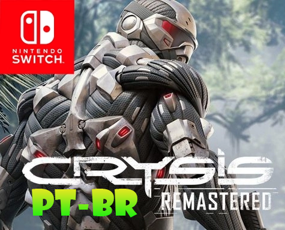

<h1 align="center"><figure>
  
</figure></h1>


## Sobre a Tradução.

Tradução feita pelo grupo GameVicio.

_ "Portado para Nintendo Switch por Traduções GBJ" _

## Por quê?

Este projeto irá ajudar muitas pessoas a entender melhor a história do jogo, portanto ficarei feliz se você puder ajudar de alguma forma o projeto, tradução, erros ortográficos e revisão em jogo!

## Requerimentos

- Obrigatório o uptade Ver 1.2 (v131072)
- Nintendo Switch Debloqueado - SXOS ou ATMOSPHERE>

## Instalação

- **SXOS:** Colar a pasta ```SXOS``` dentro do MicroSD e iniciar o jogo normalmente.

- **ATMOSPHERE:** Colar a pasta ```ATMOSPHERE``` dentro do MicroSD e iniciar o jogo normalmente.

## Ferramentas Ultilizadas

- [Visual Studio Code](https://code.visualstudio.com)
- [Excel 2016](https://www.office.com/?omkt=pt-br)
- [SDL Trados Studio 2019](https://www.sdltrados.com)

## Doações

[](https://picpay.me/gilsongbj)

Obrigado!:wave:

